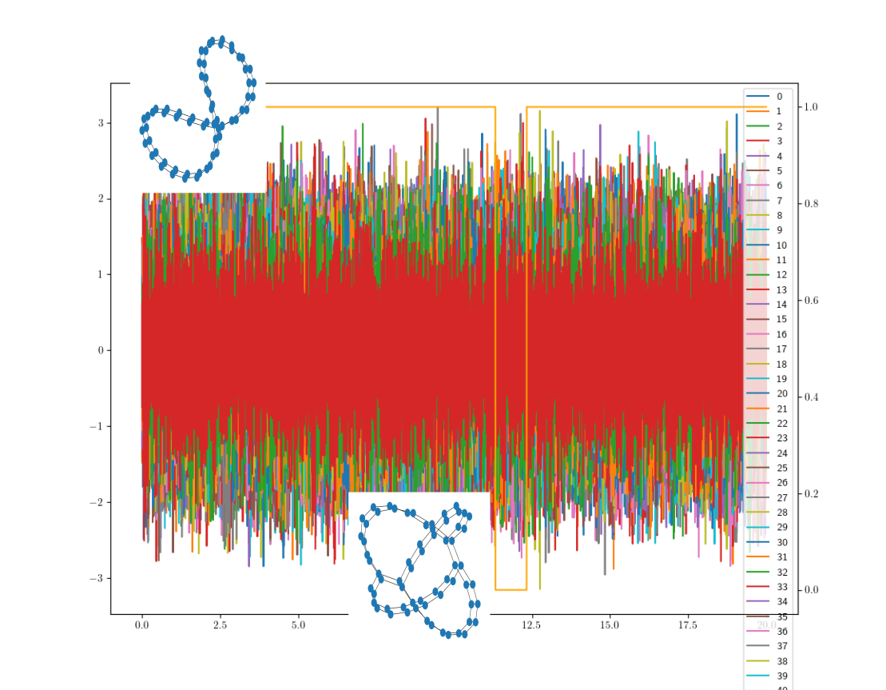

# Topological Wheels

Topological Wheels is a learning problem consisting in a set of datasets are introduced in [F. Chazal, C. Levrard and M. Royer. Topological Analysis for Detecting Anomalies (TADA) in Time Series, 2024](https://hal.science/hal-04604083). They are inspired by [El-Yaagoubi AB, Chung MK, Ombao H. Statistical inference for dependence networks in topological data analysis. Front Artif Intell. 2023;6:1293504. Published 2023 Dec 14.](doi:10.3389/frai.2023.1293504). The problem is to detect anomalous timestamps from the signal.

There are ten datasets, and each dataset consists in a multivariate timeseries $X$ , and a binary timeseries $is_anomaly$ that acts as a ground truth. The multivariate timeseries $X$ has dependence patterns that simulates that of real brain signals. The "normal" dependence pattern is active throughout the entire timeseries, except for one time window of 500 consecutive timestamps where it is changed into a different one. That time window cannot be located near the beginning or end of the timeseries. This is what variable $is_anomaly$ indicates.



To open a dataset one can use:
```python
# pandas
dataset = pd.read_csv(path_to_file, header=0, index_col=0, compression='gzip')
X, y = dataset.iloc[:, :-1], dataset.iloc[:, -1]

# numpy
dataset = np.genfromtxt(path_to_file, delimiter=',', skip_header=1)
X, y = dataset[:, 1:-1], dataset[:, -1]
```
